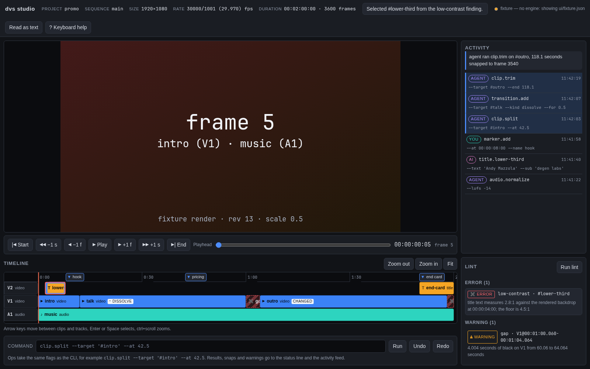

# degen-video-studio

An agent-native video editor. `dvs` CLI · MCP server · Rust engine · JSON documents ·
ffmpeg for codecs · Linux and macOS.

The edit is a document an agent can read, diff, re-run and render headlessly. 98 ops, one
registry, two front ends — the CLI and an MCP server — over one renderer.

```bash
dvs new promo --fps 30000/1001 --size 1920x1080
dvs asset import talk.mp4 music.mp3
dvs op track.add --kind video
dvs op clip.insert --track V1 --source talk --at 0 --duration 12
dvs op transcript.cut-words --target '#talk' --words um,uh,like --min-gap 0.25
dvs op title.lower-third --text "Andy Mazzola" --sub "degen labs" --at 2 --for 4 --track V2
dvs op audio.normalize --lufs -14
dvs lint --json                    # gaps, loudness, unreadable captions, off-frame titles
dvs render out.mp4 --digest digest.json
dvs export kdenlive promo.kdenlive # hand it to a human
```

## Why it exists

[Diffusion Studio](https://diffusion.studio) made video editing agent-native by making the
edit *be* a document. Kdenlive, Shotcut and Resolve have the engine but no agent surface —
verified on 2026-09-21: Kdenlive 26.08 exposes no D-Bus or scripting API, and its CLI is
open-render-exit. This project is the combination: an editing engine whose primary operator
is a machine, whose documents open in Kdenlive when a human wants to finish by hand.

Three things make it usable by something that cannot watch the video:

1. **A feedback channel on every capability.** Every render can emit a digest: per-clip
   ranges and sources, gaps, integrated LUFS and true peak, silences, scene cuts, black and
   frozen stretches, title overflow and contrast against the *rendered* backdrop, caption
   reading rate. `dvs lint` turns 29 of those measurements into findings that each name the
   selector of the offender.
2. **Text-native editing.** Word-timestamped transcripts are a first-class layer:
   `transcript.cut-words` ripple-deletes filler words and keeps linked audio in sync,
   `transcript.keep-phrases` keeps only what matters, `caption.generate` builds cues that
   respect a reading-rate ceiling and reports the maximum it produced.
3. **Incremental rendering.** The timeline is split into segments at every discontinuity and
   each is cached under a hash of everything that can change its frames. Editing one title
   in a ten-minute video re-encodes one segment. Measured on this machine: a 7 s / 210-frame
   two-segment project renders cold in 7.3 s and re-renders in 0.2 s with both segments
   reused.

## Install

Needs `ffmpeg` and `ffprobe` on `PATH` (or `DVS_FFMPEG`/`DVS_FFPROBE`):

```bash
sudo pacman -S ffmpeg          # Arch
brew install ffmpeg            # macOS
cargo install --path crates/dvs-cli
dvs doctor                     # reports toolchain, encoders, project health
```

Optional: `--features whisper` on `dvs-text` for local transcription (needs `cmake` to build
whisper.cpp). Without it, `transcript.import` accepts word JSON from whisper.cpp, WhisperX or
any `[{text,start,end}]` array.

## The document

`project.json` is the whole edit — see [docs/document-format.md](docs/document-format.md).
Media never enters it: `assets/` is content-addressed by blake3, `cache/` holds regenerable
proxies and rendered segments, `history.jsonl` is the append-only op journal that undo walks.

Time is exact. Positions are rational seconds (`"1001/30"`), frame rates are rationals
(`30000/1001`, never `29.97`), and every op snaps an incoming time to the sequence grid and
*reports the snap*:

```json
{ "op": "clip.split", "seq": 12,
  "snapped": [ { "field": "at", "requested": "85/2", "applied": "637637/15000", "frame": 1274 } ] }
```

## The agent surface

- **`--json` on every command**, one object on stdout, notes on stderr, errors as
  `{"error":{kind,code,message,candidates}}`.
- **Exit codes mean something**: `0` ok · `1` op error · `2` bad arguments · `3` selector
  matched nothing · `4` lint findings · `5` tool missing · `6` budget exceeded.
- **Errors carry the fix**: `track 'V9' matched nothing; candidates: V1, V2, A1`, and on an
  empty sequence, the op that creates one.
- **Runtime discovery**: `dvs op --list`, `dvs schema --op clip.split`,
  `dvs schema --project-schema`.
- **Selectors, never indices**: `#intro`, `clip[track=V1]`, `clip[kind=title]`,
  `clip[track=V1]@00:10-00:20`, `track[kind=audio]`, `:first`/`:last`/`:nth(2)`.
- **MCP**: `dvs mcp` serves 105 tools over stdio — one per op plus `dvs_overview`,
  `dvs_apply` (transactional batch: thirty edits, one round trip, all-or-nothing),
  `dvs_render`, `dvs_lint`, `dvs_frame` (PNG + annotations), `dvs_transcript`, `dvs_history`.

Details in [docs/agent-interface.md](docs/agent-interface.md).

## Op catalog

98 ops across 16 namespaces: `asset` (6) · `seq` (8) · `track` (10) · `clip` (19) · `fx` (6) ·
`kf` (4) · `transition` (2) · `marker` (5) · `title` (4) · `audio` (7) · `transcript` (5) ·
`caption` (5) · `inspect` (6) · `export` (6) · `import` (1) · `ai` (4).

## The window



`dvs-studio` opens a project in a native window — viewport, timeline, the op journal
streaming past as an agent edits, lint findings, and a console that runs the same ops the
CLI does. Full detail in [docs/studio.md](docs/studio.md).

```bash
dvs-studio --project ~/promo      # watch it being driven
dvs-studio --describe             # the same information as text, no window
```

It is a [Tauri](https://tauri.app) window with a plain HTML frontend (no npm, no bundler),
and that is an **accessibility** decision before a rendering one: HTML semantics reach
ATK/Orca and VoiceOver, so a clip is a labelled control a screen reader announces rather
than a rectangle in a canvas. The timeline is a `role="grid"` whose cells read as
"intro, video clip on V1, 0 to 12.012 seconds, plays talk.mp4"; every action has a key;
nothing is encoded in colour alone; `--describe` prints the whole window as text. axe-core
reports zero violations across six page states, and `scripts/a11y-tree.py` dumps the real
window's accessibility tree so the claim stays checkable.

Human and agent share one document: a console edit is journalled as `human` in the same
`history.jsonl`, and the window follows an agent's edits within ~200 ms.

## Interop

`.kdenlive` is MLT XML, so `dvs export kdenlive` produces a project Kdenlive 26.08 opens and
`melt` renders — the exported timeline of the smoke project renders to the same 210 frames at
`30000/1001` as the native renderer. FCPXML 1.11 covers Final Cut and Resolve, OTIO covers
everyone else, CMX3600 EDL and SRT/VTT round-trip. Features with no equivalent in a format
(a vector title, a generator) are exported as placeholders of the right length and listed in
the export's warnings rather than silently dropped.

## Architecture

Twelve crates, dependency direction strictly downward — see
[docs/architecture.md](docs/architecture.md).

`dvs-core` (document, time, selectors, op registry, journal) → `dvs-media` (the only crate
that spawns ffmpeg) → `dvs-comp` (the one compositor) → `dvs-audio`, `dvs-text`,
`dvs-interop`, `dvs-render`, `dvs-inspect`, `dvs-ai` → `dvs-cli`, `dvs-mcp`, `dvs-studio`.

Frames are premultiplied **linear-light f32 RGBA** end to end, so a dissolve passes through
50% light rather than 50% encoded value. Color range and matrix are read from the probe and
passed to ffmpeg explicitly on every decode, and the encoder tags what it wrote.

## Status

P0–P8 of [PLAN.md](PLAN.md) are implemented and tested — document and journal, video render,
audio, titles and keyframes, inspect, transcripts and captions, the agent surface with the
segment cache, interop, the optional AI providers — plus P7, the studio window, as a Tauri
app rather than the originally planned web shell. Not built: release packaging and signing
(P9), and audio monitoring in the window (playback is picture-only; `cpal` wiring is not
done). Every crate's tests run against real ffmpeg, real encodes and real `melt`;
`cargo test --workspace` is green with no warnings.
